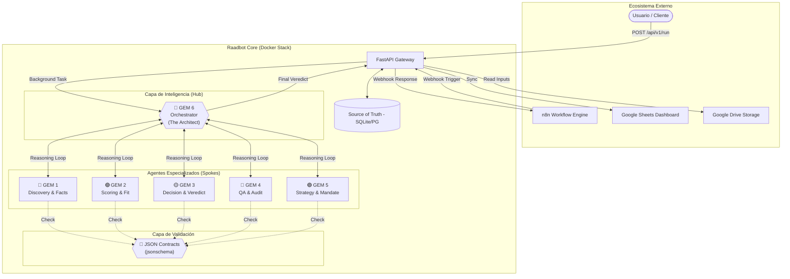
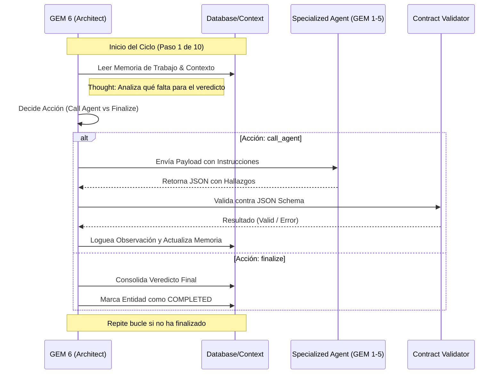
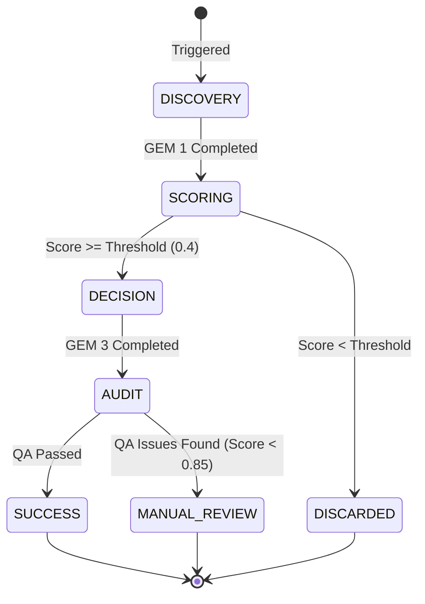

# 🤖 Raadbot v3.0 — Industrial Multi-Agent Intelligence

> 🎯 **Objetivo**
>
> Raadbot v3.0 es un ecosistema multi-agente industrial basado en el framework GEM, orquestado por **GEM 6 (The Architect)** bajo una arquitectura **Hub-and-Spoke 3.0**. Diseñado para procesamiento masivo de candidatos, trazabilidad total y decisiones autónomas de alta precisión.

---

## 🏗️ Arquitectura del Sistema: Hub-and-Spoke 3.0

A diferencia de las versiones anteriores secuenciales, Raadbot v3.0 utiliza un modelo de **Orquestación Autónoma**. GEM 6 actúa como el cerebro central que decide dinámicamente qué agentes invocar basándose en el contexto del candidato y los objetivos del mandato.

### 📊 Diagrama de Arquitectura Detallada



---

## 🧠 Ciclo de Razonamiento GEM 6

El orquestador no sigue un script lineal; opera en un bucle de **Pensamiento -> Acción -> Observación** (máximo 10 pasos por entidad).

### 🔄 Flujo de Ejecución Autónoma



---

## 🧩 Agentes Especializados (The Spokes)

| Agente | Color | Misión | Tooling Interno |
| :--- | :---: | :--- | :--- |
| **GEM 5** | 🟣 | **Strategy**: Define la radiografía del proyecto y el mandato. | Análisis de JD y Briefing. |
| **GEM 1** | 🔵 | **Discovery**: Extrae hechos, métricas y trayectoria real. | Análisis de CV y Entrevistas. |
| **GEM 2** | 🟢 | **Scoring**: Evalúa el fit técnico y cultural (0.0 a 1.0). | Rúbricas de calibración. |
| **GEM 3** | 🟡 | **Decision**: Genera el veredicto final y argumentos 360°. | Síntesis de evidencia. |
| **GEM 4** | 🔴 | **QA Gate**: Audita el proceso buscando alucinaciones. | Verificación cruzada. |

---

## 🚦 Estados del Candidato (Lifecycle)

El sistema gestiona el ciclo de vida de cada candidato de forma independiente, permitiendo paradas tempranas (*early exits*) si la calidad no es suficiente.



---

## 🚀 Despliegue y Uso

### Instalación con Docker
```bash
git clone https://github.com/tomascarminatti-ux/raadbot.git
cd raadbot
cp .env.example .env
docker compose up -d --build
```

### Integración con n8n
Raadbot está diseñado para ser "API-First". Puedes disparar el pipeline desde n8n enviando un POST a `/api/v1/run` con un `webhook_url`. El sistema procesará los candidatos en segundo plano y notificará a n8n cuando termine.

### Endpoints Críticos
- `POST /api/v1/run`: Inicia el pipeline autónomo.
- `POST /api/v1/search/setup`: Ejecuta GEM 5 para definir la estrategia de una búsqueda.
- `GET /dashboard`: Visualización en tiempo real del estado de los agentes.
- `GET /health`: Estado del sistema y versión.

---

## 🛡️ Estándares Industriales y Calidad

- **Contratos JSON**: Cada agente tiene un esquema en `contracts/`. Si el LLM falla el contrato, GEM 6 detecta el error y puede reintentar o marcar falla.
- **Trazabilidad (Trace ID)**: Cada decisión de GEM 6 y cada respuesta de los agentes está vinculada a un `trace_id` único en la DB para auditorías.
- **Cost Control**: Implementación de *Early Exit* en GEM 2 para no procesar candidatos de bajo fit en agentes más costosos (GEM 3/4).

---
Version 3.0.0 — Raad Advisory Industrial Platform
