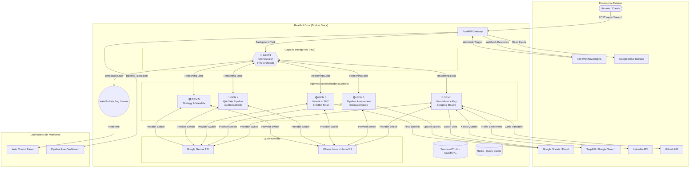
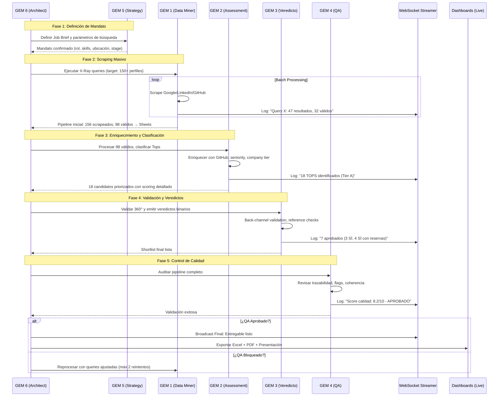

# 🤖 Raadbot v3.0 — Industrial Multi-Agent Intelligence (Pipeline Edition)

> 🎯 **Objetivo**
>
> Raadbot v3.0 es un ecosistema multi-agente industrial basado en el framework GEM, orquestado por **GEM 6 (The Architect)** bajo una arquitectura **Hub-and-Spoke 3.0**. Diseñado para **búsqueda masiva de talento vía scraping inteligente**, enriquecimiento automático de datos, trazabilidad total del pipeline, decisiones autónomas de alta precisión y ejecución flexible (Cloud/Local).

---

## 🏗️ Arquitectura del Sistema: Hub-and-Spoke 3.0 (Pipeline Massivo)

A diferencia de las versiones anteriores secuenciales, Raadbot v3.0 utiliza un modelo de **Orquestación Autónoma con Procesamiento Batch**. GEM 6 actúa como el cerebro central que decide dinámicamente qué agentes invocar, cuándo escalar búsquedas, y cómo optimizar la conversión de pipeline.

### 📊 Diagrama de Arquitectura Detallada



---

## 🧠 Ciclo de Razonamiento y Monitoreo Live (Pipeline Edition)

El orquestador opera en un bucle de **Pensamiento -> Acción -> Observación -> Optimización**, diseñado para procesar volúmenes masivos (100-500 perfiles) con telemetría en tiempo real.

### 🔄 Flujo de Ejecución Masiva y Telemetría



---

## 🧩 Agentes Especializados (The Spokes) — Pipeline Edition

| Agente | Color | Misión | Input | Output | Tooling Interno |
| :--- | :---: | :--- | :--- | :--- | :--- |
| **GEM 5** | 🟣 | **Strategy**: Define la radiografía del proyecto, mandato de búsqueda y criterios de éxito del pipeline. | Job Brief del cliente | Mandato estructurado, queries sugeridas | Análisis de JD, definición de must-have/nice-to-have |
| **GEM 1** | 🔵 | **Data Miner**: Ejecuta Google X-Ray scraping masivo, construye pipeline inicial y exporta a Sheets/Excel. | Mandato GEM 5 | 100-500 perfiles scrapeados, datos estructurados | Google Dorking, SerpAPI, LinkedIn scraping, GitHub API, export Sheets |
| **GEM 2** | 🟢 | **Pipeline Assessment**: Enriquece datos, calcula fit scores, clasifica en Tiers (A/B/C) y prioriza oportunidades. | Dump de GEM 1 | 15-25 TOPS con scoring detallado | Enriquecimiento de datos, cálculo de seniority, industry alignment, company tier |
| **GEM 3** | 🟡 | **Veredicto 360°**: Valida referencias back-channel, emite veredictos binarios (SÍ/NO/SÍ con reservas), genera shortlist final. | TOPS de GEM 2 | 3-7 candidatos aprobados con dossier completo | Validación 360°, cross-reference de datos, generación de FODA contextualizado |
| **GEM 4** | 🔴 | **QA Gate Pipeline**: Audita calidad del proceso completo, trazabilidad de cada candidato, y bloquea entregas con flags críticos. | Output completo de GEM 3 | Decisión APROBADO/BLOQUEADO con métricas de calidad | Detección de inconsistencias, validación de trazabilidad, cálculo de score de calidad |

---

## 📊 Métricas de Pipeline y KPIs

Raadbot v3.0 trackea métricas industriales en cada ejecución:

| Métrica | Descripción | Target |
|---------|-------------|--------|
| **Scrape Rate** | % de perfiles scrapeados que son válidos (no duplicados, no inactivos) | >60% |
| **Conversion GEM1→GEM2** | % de válidos que califican como TOPS | 15-25% |
| **Conversion GEM2→GEM3** | % de TOPS que son aprobados (SÍ/SÍ con reservas) | 30-40% |
| **Pipeline Yield** | Candidatos finales aprobados / Total scrapeados | 3-7% |
| **Calidad GEM4** | Score de auditoría del proceso (0-10) | >7.0 |
| **Tiempo Total** | Horas desde mandato hasta entrega | <24h para 150 perfiles |
| **Costo por Aprobado** | USD gastado en APIs / Candidatos aprobados | <$50 |

---

## 🚀 Despliegue y Configuración

### 1. Requisitos e Instalación
```bash
git clone https://github.com/tomascarminatti-ux/raadbot.git 
cd raadbot
cp .env.example .env

# Instalar dependencias
pip install -r requirements.txt

# Configurar credenciales de scraping
echo "SERPAPI_KEY=tu_key" >> .env
echo "GEMINI_API_KEY=tu_key" >> .env
echo "LINKEDIN_COOKIE=tu_cookie" >> .env  # Opcional, para scraping avanzado
```

### 2. Configuración de LLM (Híbrida/Local)
En tu archivo `.env`:
```bash
# Opción Cloud (rápido, costo por token)
LLM_PROVIDER=gemini
GEMINI_API_KEY=sk-...

# Opción Local (privado, lento para batches grandes)
LLM_PROVIDER=ollama
OLLAMA_MODEL=llama3.3:70b
```

### 3. Ejecución de Pipeline Masivo
```bash
# Iniciar búsqueda completa (GEM 5 → GEM 1 → GEM 2 → GEM 3 → GEM 4)
python -m raadbot.pipeline run \
  --search-id "SEARCH-2026-001" \
  --role "Staff Data Engineer" \
  --location "Madrid,Remoto España" \
  --skills "Python,Spark,AWS" \
  --target-size 150 \
  --output-format google_sheets

# Monitorear en tiempo real
streamlit run dashboard_pipeline.py
```

### 4. APIs Disponibles
```bash
# Endpoint principal para búsquedas
POST /api/v1/search
{
  "role": "VP Engineering",
  "location": ["Mexico", "Colombia"],
  "must_have_skills": ["Fintech", "Scaling"],
  "company_stage": "Series B",
  "target_pipeline": 200
}

# Estado de pipeline en curso
GET /api/v1/search/{search_id}/status

# Resultados finales
GET /api/v1/search/{search_id}/results
```

---

## 🚦 Monitoreo Industrial (Pipeline Edition)

Raadbot v3.0 ofrece tres niveles de visibilidad para operaciones masivas:

### 1. **Control Panel (Web)** — Gestión de Queries
- Editor visual de queries X-Ray para GEM 1
- Monitoreo de rate limits (Google/SerpAPI)
- Terminal de logs por WebSocket con filtros por GEM
- Ajuste dinámico de thresholds de scoring

### 2. **Pipeline Live Dashboard (Streamlit)** — Visión Ejecutiva
- **Funnel visual**: Scrapeados → Válidos → TOPS → Aprobados
- **Mapa de calor**: Distribución geográfica del pipeline
- **Análisis de skills**: Match vs must-have del Job Brief
- **Trazabilidad individual**: Click en candidato para ver cadena completa (Query → Score → Veredicto)

### 3. **Trazabilidad DB Forense**
- Cada candidato tiene `trace_id` único
- Registro completo: qué query lo encontró, qué GEM lo aprobó/rechazó, por qué
- Auditoría de decisiones de IA para compliance
- Exportable a CSV para revisión humana

---

## 🔄 Flujo de Datos entre GEMs (Pipeline)

```
┌─────────────┐     ┌─────────────┐     ┌─────────────┐     ┌─────────────┐     ┌─────────────┐
│   GEM 5     │────▶│   GEM 1     │────▶│   GEM 2     │────▶│   GEM 3     │────▶│   GEM 4     │
│  (Strategy) │     │(Data Miner) │     │(Assessment) │     │ (Veredicto) │     │  (QA Gate)  │
└─────────────┘     └─────────────┘     └─────────────┘     └─────────────┘     └─────────────┘
       │                   │                   │                   │                   │
       ▼                   ▼                   ▼                   ▼                   ▼
  Job Brief           Google Sheets       Google Sheets       Google Sheets       Decisión Final
  Queries X-Ray       100-500 filas       15-25 TOPS          3-7 Aprobados       APROBADO/
  Criterios           Raw data            Enriquecido         Dossier completo    BLOQUEADO
```

---

## 🛡️ Guardrails y Ethics

- **GDPR Compliance**: Solo datos públicos, no almacenar información sensible
- **Rate Limiting**: Máximo 100 queries/minuto a Google, delays entre requests
- **Sesgo Mitigación**: Auditar diversidad de pipeline en GEM 4 (género, ubicación, background)
- **Transparencia**: Cliente puede solicitar `trace_id` de cualquier candidato presentado

---
**Version 3.0.0-Pipeline** — Raad Advisory Industrial Platform | Mass Talent Intelligence
