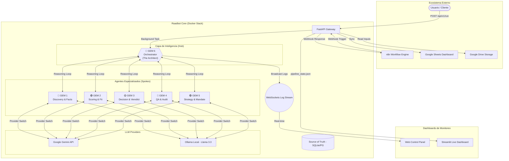
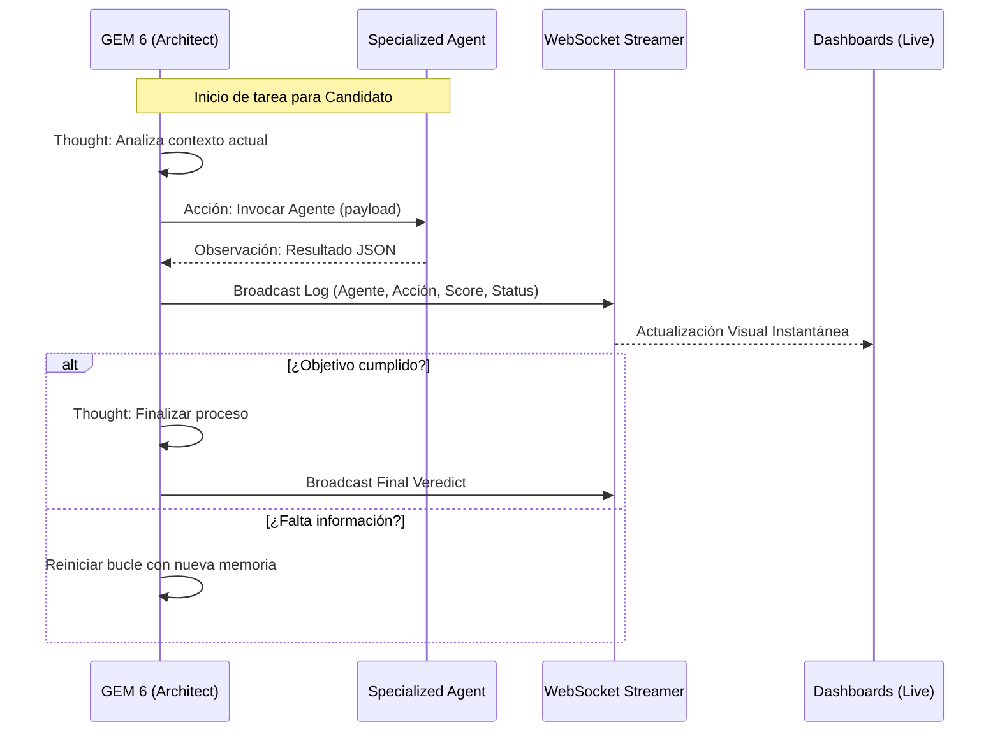

# 🤖 Raadbot v3.0 — Industrial Multi-Agent Intelligence

> 🎯 **Objetivo**
>
> Raadbot v3.0 es un ecosistema multi-agente industrial basado en el framework GEM, orquestado por **GEM 6 (The Architect)** bajo una arquitectura **Hub-and-Spoke 3.0**. Diseñado para procesamiento masivo de candidatos, trazabilidad total, decisiones autónomas de alta precisión y ejecución flexible (Cloud/Local).

---

## 🏗️ Arquitectura del Sistema: Hub-and-Spoke 3.0

A diferencia de las versiones anteriores secuenciales, Raadbot v3.0 utiliza un modelo de **Orquestación Autónoma**. GEM 6 actúa como el cerebro central que decide dinámicamente qué agentes invocar basándose en el contexto del candidato y los objetivos del mandato.

### 📊 Diagrama de Arquitectura Detallada



---

## 🧠 Ciclo de Razonamiento y Monitoreo Live

El orquestador opera en un bucle de **Pensamiento -> Acción -> Observación**. Cada paso es transmitido en tiempo real a través de WebSockets.

### 🔄 Flujo de Ejecución y Telemetría



---

## 🧩 Agentes Especializados (The Spokes)

| Agente | Color | Misión | Tooling Interno |
| :--- | :---: | :--- | :--- |
| **GEM 5** | 🟣 | **Strategy**: Define la radiografía del proyecto y el mandato. | Análisis de JD y Briefing. |
| **GEM 1** | 🔵 | **Discovery**: Extrae hechos, métricas y trayectoria real. | Análisis de CV y Entrevistas. |
| **GEM 2** | 🟢 | **Scoring**: Evalúa el fit técnico y cultural (0.0 a 1.0). | Rúbricas de calibración. |
| **GEM 3** | 🟡 | **Decision**: Genera el veredicto final y argumentos 360°. | Síntesis de evidencia. |
| **GEM 4** | 🔴 | **QA Gate**: Audita el proceso buscando alucinaciones. | Verificación cruzada. |

---

## 🚀 Despliegue y Configuración

### 1. Requisitos e Instalación
```bash
git clone https://github.com/tomascarminatti-ux/raadbot.git
cd raadbot
cp .env.example .env
pip install -r requirements.txt
```

### 2. Configuración de LLM (Híbrida/Local)
En tu archivo `.env`, puedes elegir el motor de ejecución:
- **Cloud**: `LLM_PROVIDER=gemini` (Requiere `GEMINI_API_KEY`)
- **Local**: `LLM_PROVIDER=ollama` (Requiere Ollama corriendo con `llama3.3:70b`)

### 3. Ejecución
- **Backend API**: `uvicorn api:app --reload`
- **Dashboard Web**: Accede a `http://localhost:8000/dashboard`
- **Streamlit Live**: `streamlit run dashboard_streamlit.py`

---

## 🚦 Monitoreo Industrial

Raadbot v3.0 ofrece tres niveles de visibilidad:
1. **Control Panel (Web)**: Interfaz principal para ver y refinar prompts de agentes en tiempo real. Incluye una terminal de logs por WebSocket.
2. **Live Dashboard (Streamlit)**: Visor ejecutivo que muestra el historial de pasos, scores y veredictos finales con filtros avanzados.
3. **Trazabilidad DB**: Cada paso genera un `trace_id` único para auditoría forense de decisiones de la IA.

---
Version 3.0.0 — Raad Advisory Industrial Platform
