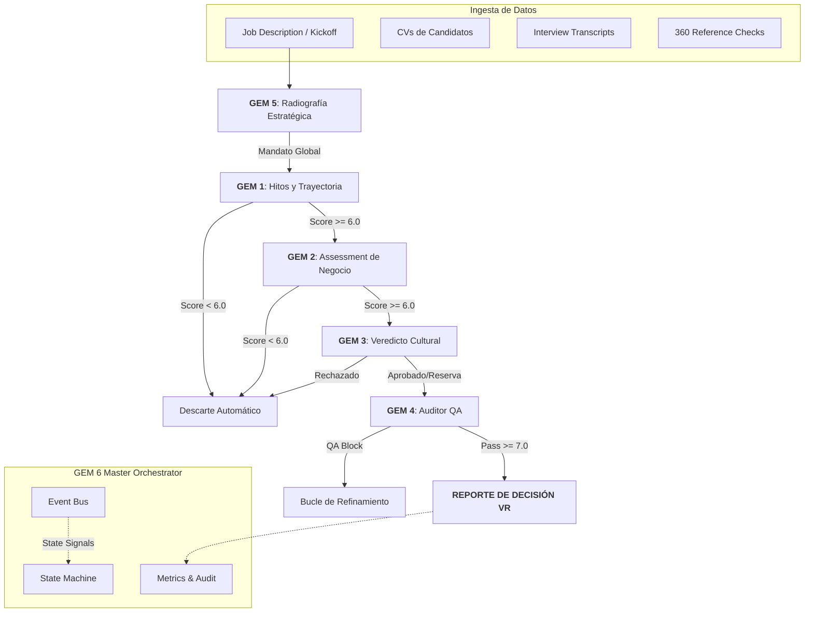

# 🤖 Raadbot v2.0 — Executive Search Industrial Pipeline

**Raadbot** es el estándar de oro en sistemas de orquestación de IA para la **Búsqueda Ejecutiva de Alto Nivel**. No es un simple chatbot; es un motor de decisión industrial de grado producción diseñado para transformar la naturaleza de la evaluación de talento C-Level, VP y Directores.

---

## 🌟 Visión y Valor Core

En el mundo de la búsqueda ejecutiva, la subjetividad es el enemigo. Raadbot nace para eliminar el sesgo mediante una **Trazabilidad de Evidencia Estricta**.

- **Evidence-First**: Los agentes no pueden emitir juicios sin citar la fuente exacta `[Fuente: CV/Entrevista]`.
- **Rigor Analítico**: Prohíbe el "clinical jargon" y el "fluff". Traduce narrativa vaga a impacto de negocio.
- **Gating de Calidad**: Si la evidencia no es suficiente el sistema bloquea el reporte, protegiendo la reputación de la firma.

---

## 🏗️ Arquitectura de Sistema: GEM 6 Master Orchestrator

Raadbot v2.0 opera bajo un patrón de **Orquestador-Worker** liderado por el motor **GEM 6**. Esta capa gestiona la complejidad de una evaluación multi-agente.

### Componentes de Ingeniería (`agent/gem6/`):
- **🧠 Master Orchestrator**: El núcleo que gestiona el ciclo de vida, la resiliencia y la orquestación distribuida de los GEMs.
- **🚥 State Machine**: Máquina de estados determinista que previene regresiones. Un candidato no puede ser evaluado en cultura (GEM 3) si no aprobó los hitos de trayectoria (GEM 1).
- **🚌 Event Bus**: Sistema de comunicación asíncrono que desacopla la lógica de negocio de los efectos secundarios (logging, métricas, webhooks).
- **📊 Metrics & Dashboard**: Recolección de KPIs tácticos (latencia, tokens) y estratégicos (scores de ajuste, veredictos).
- **📝 Audit Ledger**: Registro de auditoría con checksums SHA-256 para cada nodo de decisión, garantizando integridad y cumplimiento legal (compliance).

---

## 🗺️ Mapa de Evaluación (Evaluation Flow v2.0)



---

## 💎 Los Módulos GEM (v2.0 Analytical Edition)

### 🔵 GEM 5: El Radiólogo Estratégico
**Input**: Notas de Kick-off + Job Description.  
**Misión**: Definir el "Dolor del Cliente" a nivel operativo. Produce el **Mandato de Búsqueda** que actuará como ancla contextual para el resto de los módulos.

### 🟢 GEM 1: El Historiador de Logros
**Misión**: Convertir la narrativa del CV y la entrevista en evidencia calibrada.  
**Filtro**: Ignora adjetivos autoproclamados y busca métricas cuantificables (%, $, unidades, tiempos).

### 🟡 GEM 2: El Consultor de Negocio
**Misión**: Contrastar al candidato contra los retos técnicos y de negocio definidos en GEM 5.  
**Salida**: Evaluación de capacidad de resolución de problemas específicos del cliente.

### 🟣 GEM 3: El Juez de Veredicto
**Misión**: Realizar la síntesis final basada en referencias 360° y fit cultural.  
**Decisión**: Emite un veredicto binario: **YES / NO / YES (with reservations)**. No se permite la tibieza.

### 🔴 GEM 4: El Fiscal Auditor
**Misión**: Control de calidad final.  
**Acción**: Bloquea cualquier reporte con alucinaciones, falta de fuentes o lenguaje impreciso. Calcula el **Quality Index** del reporte.

---

## 🕹️ Modos de Operación

### 1. Centro de Control (Web Dashboard) 🌐
Interfaz premium para monitorear ejecuciones y tunear prompts sin tocar código.
- **Acceso**: `http://localhost:8000/dashboard` (vía `./start_localhost.sh`)
- **AI Refinement**: Chatea con el orquestador para ajustar el comportamiento de cada GEM.

### 2. Microservicio Integrado (API REST) 📡
Listo para conectar con **Netlify**, **n8n** o herramientas internas.
- **Trigger**: `POST /api/v1/run`
- **Search Setup**: `POST /api/v1/search/setup` (GEM 5 initialization)
- **Health**: `GET /health` (Estado del sistema y versión)

### 3. Ejecución Masiva (CLI) 💻
Ideal para procesamiento de lotes grandes o auditorías de búsqueda.
```bash
python run.py --search-id PROY-01 --local-dir inputs/search_01 --json
```

---

## 🚀 Despliegue y Hardening

### Seguridad y Resiliencia
- **State Checkpoints**: El archivo `pipeline_state.json` permite reanudar ejecuciones fallidas.
- **Secret Management**: Soporte nativo para `.env` y variables de entorno seguras.
- **Docker Ready**: `docker-compose.yml` incluido para despliegues portables y producción.

### Instalación Rápida
```bash
git clone https://github.com/tomascarminatti-ux/raadbot.git
cd raadbot
pip install -r requirements.txt
cp .env.example .env # Configura tus API Keys
```

---

## 📈 Observabilidad
Raadbot exporta en cada corrida:
1.  **JSON Estructurado**: Para consumo de BI o bases de datos de talento.
2.  **Markdown Legible**: Reportes formateados para consultores humanos.
3.  **Metrics Dashboard**: Consumo de tokens, costos por búsqueda y latencia de respuesta.

---

## 🤝 Soporte y Contribución
Para reportar bugs o solicitar nuevas funcionalidades para GEMs específicos, favor de abrir un Issue o contactar al equipo de arquitectura RAAD.

*Version 2.0.0 — Optimizado para Gemini 2.0*
