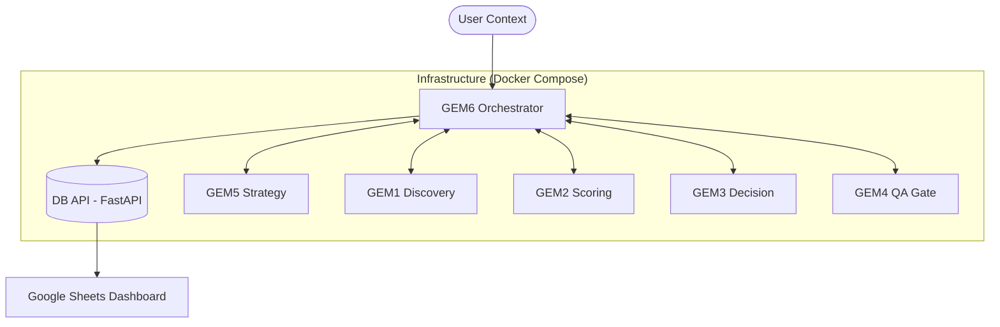

# 🤖 Raadbot v3.0 — Industrial Multi-Agent Intelligence

> 🎯 **Objetivo**
>
> Raadbot v3.0 es un ecosistema multi-agente industrial basado en el framework GEM, orquestado por GEM 6 bajo una arquitectura **Hub-and-Spoke**. Diseñado para procesamiento masivo, trazabilidad total en base de datos y visualización ejecutiva en Google Sheets.

---

## 🏗️ Arquitectura Técnica: Hub-and-Spoke

El sistema utiliza **GEM 6** como el orquestador central que valida contratos y gestiona el flujo de trabajo entre agentes especializados (GEM 1-4), manteniendo una separación clara entre la lógica de negocio, la persistencia de datos (FastAPI) y la vista humana (Sheets).

### 📊 Diagrama de Flujo



---

## 🧩 Componentes del Ecosistema

### 1) 🧠 GEM 6 — Master Orchestrator (The Hub)

- **Misión**: Controlar el ciclo de vida, validar contratos JSON y aplicar umbrales operativos (Threshold Enforcement).
- **Gating**: Si un agente falla el contrato o no alcanza el score mínimo (e.g. GEM2 < 0.4), GEM 6 detiene el flujo o descarta la entidad.

### 2) 🤖 Agentes Especializados (Spokes)

- **🟣 GEM 5 — Strategy**: Radiografía de mandatos y validación de proyectos (Go/No-Go).
- **🔵 GEM 1 — Discovery**: Descubrimiento masivo y verificación inicial de datos.
- **🟢 GEM 2 — Scoring & Filtrado**: Evaluación de calidad y fit inicial.
- **🟡 GEM 3 — Decisión**: Motor de veredicto final (Accept/Review/Reject).
- **🔴 GEM 4 — QA Gate**: Auditoría final para prevenir alucinaciones e inconsistencias.

### 3) 🗄️ Database Layer (Source of Truth)

- **Servicio**: FastAPI + SQLite (Migrable a PostgreSQL).
- **Tablas**: `entity_state`, `discarded_entities`, `discovery_logs`, `performance_metrics`.
- **Acceso**: `http://localhost:8000/docs`

### 4) 📤 Google Sheets Sync

- **Misión**: Vista humana simplificada. Sincroniza el estado de la DB con un dashboard en la nube para auditoría no técnica.

---

## 🚀 Despliegue Reproducible

El sistema está contenedorizado totalmente para garantizar reproducibilidad industrial.

### Instalación Rápida

```bash
git clone https://github.com/tomascarminatti-ux/raadbot.git
cd raadbot
cp .env.example .env
docker compose up -d --build
```

### Comandos Críticos

- **Ver Logs**: `docker compose logs -f gem6`
- **Métricas**: `python scripts/metrics_summary.py`
- **Sincronización**: `python scripts/sheets_dump.py`

### Entorno de Desarrollo (IDE)

Para VS Code, el proyecto incluye un archivo `.vscode/settings.json` preconfigurado. Pylance está configurado para usar el entorno virtual (`.venv/bin/python`) y leer la carpeta raíz para resolver importaciones internas como `agent` o `utils`. No se requiere `pyrightconfig.json`.

---

## 🛡️ Estándares Industriales

- **Contratos JSON**: Cada agente opera bajo esquemas estrictos alojados en `contracts/`.
- **Logging Estructurado**: Logs en formato JSON para ingesta en ELK o monitoreo avanzado.
- **Control de Costos**: Gestión de `max_tokens` y paradas tempranas (*early exits*) basadas en scores.
- **Trazabilidad**: Cada acción genera un `trace_id` único vinculado en la DB.

---

## 📘 Documentación Adicional

- [RUNBOOK.md](file:///Users/tini/Documents/raadbot/RUNBOOK.md): Guía operativa ante fallos y reinicios.
- [SCALABILITY.md](file:///Users/tini/Documents/raadbot/SCALABILITY.md): Estrategia de crecimiento a multinodo y optimización de costos.

---
Version 3.0.0 — Raad Advisory Industrial Platform
