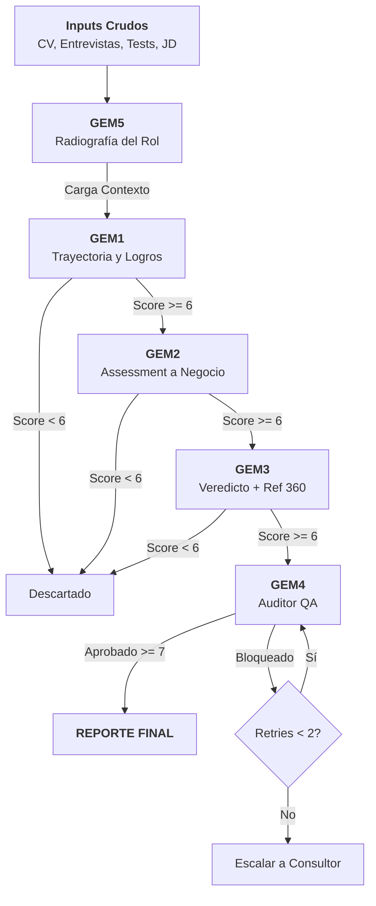

# 🤖 Raadbot – RAAD GEM Industrial Pipeline

**Raadbot** es un agente de IA avanzado diseñado para la **Búsqueda Ejecutiva Industrial**. Su función es automatizar la evaluación de candidatos de alto nivel (C-Level, VP, Directores) transformando datos crudos y heterogéneos en reportes estratégicos estructurados, con una trazabilidad psicópata de la evidencia.

Este proyecto utiliza **Gemini 2.5 Flash / Pro** (vía Google GenAI SDK) y está preparado para ejecución local (CLI), vía API (FastAPI) y orquestación automática mediante **n8n**.

---

## 🏗️ Arquitectura del Sistema

El sistema opera bajo un patrón de **Orquestador-Worker (GEM 6)**. El orquestador gestiona una máquina de estados, un bus de eventos y métricas en tiempo real para evaluar candidatos a través de múltiples módulos especializados (GEM).

### El Workflow GEM



---

## 💎 Módulos GEM (Gemini Evaluation Modules)

Cada módulo tiene una responsabilidad única y un contrato JSON estricto:

1.  **GEM5 (Radiografía Estratégica):** Analiza la Job Description y las notas de Kick-off para entender el "Problema Real" que el candidato debe resolver. Se ejecuta una vez por búsqueda.
2.  **GEM1 (Trayectoria y Logros):** Evalúa el CV y notas de entrevista. Busca hitos cuantificables y estabilidad.
3.  **GEM2 (Assessment a Negocio):** Contrasta al candidato contra los retos técnicos y de negocio definidos en GEM5.
4.  **GEM3 (Veredicto y Cultura):** Cruza las referencias 360° y el encaje cultural con el cliente.
5.  **GEM4 (Auditor QA):** Actúa como un "fiscal" interno. Revisa que todas las afirmaciones de los módulos anteriores tengan fuentes citadas `[Fuente: ...]` y que no existan alucinaciones.

---

## 🚀 Guía de Instalación

### Requisitos
- **Python 3.9+**
- **Google Gemini API Key** (Obtenla en [AI Studio](https://aistudio.google.com/apikey))
- **Google Cloud Credentials** (Opcional, para Google Drive)

### Setup Rápido
```bash
# 1. Clonar e instalar
git clone https://github.com/tomascarminatti-ux/raadbot.git
cd raadbot
pip install -r requirements.txt

# 2. Configurar entorno
cp .env.example .env
# Edita .env y pega tu GEMINI_API_KEY
```

---

## 🕹️ Modos de Operación

### 1. Terminal (CLI)
Ideal para pruebas rápidas o procesamiento local masivo.
```bash
python run.py --search-id SEARCH-2026 --local-dir inputs/SEARCH-001 --json
```

### 2. API REST (FastAPI)
Ejecuta el agente como un microservicio.
```bash
uvicorn api:app --host 0.0.0.0 --port 8000
```

### 3. Orquestación n8n (Recomendado)
Raadbot incluye plantillas en `n8n_workflows/`.
- Soporta **Webhooks asíncronos**: Raadbot ejecuta el pipeline de fondo y "llama de vuelta" a n8n cuando termina.
- **Zero Timeout**: Evita que n8n falle por esperas largas mediante el parámetro `webhook_url`.

---

## 🛠️ Hardening & Seguridad (Production Ready)

-   **State & Checkpoint:** Cada ejecución guarda su estado en `pipeline_state.json`. Si la luz se corta o el LLM falla, Raadbot reanuda exactamente donde quedó sin gastar tokens duplicados.
-   **Schema Validation:** Todas las respuestas del LLM son validadas contra JSON Schemas en `schemas/`.
-   **Smart Retries:** Ante errores de formato o bloqueos de seguridad del LLM, el sistema reintenta con backoff exponencial.
-   **Seguridad de Inputs:** El sistema bloquea automáticamente la ingesta de binarios (PDF/DOCX) en Drive para evitar inyectar basura al contexto del prompt, exigiendo formatos limpios.

---

## 📊 Observabilidad y Costos

El sistema genera un **Dashboard de Decisión** al finalizar:
- **Costo Total:** Cálculo en tiempo real de USD gastados en Gemini.
- **Token Usage:** Desglose de Prompt vs Completion tokens.
- **Trazabilidad:** Cada GEM genera un `.json` estructurado y un `.md` legible por humanos en la carpeta `runs/<search_id>/outputs/`.

---

## 🤝 Contribución
Para mantener la calidad de código:
- Usa `black .` para formatear.
- Los prompts se editan en `prompts/`.
- Los contratos se definen en `specs/`.
