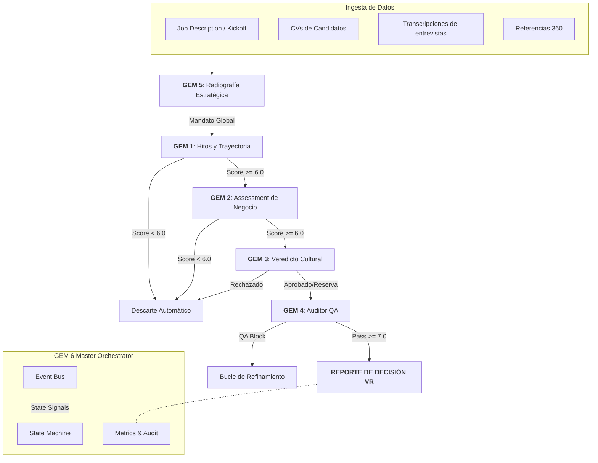

# 🤖 Raadbot v2.0 — Executive Search Industrial Pipeline

<aside>
🎯 **Objetivo**

Raadbot v2.0 es un sistema de orquestación multi‑agente para evaluación de talento ejecutivo, con enfoque *evidence-first*, trazabilidad y control de calidad (QA) antes de emitir veredictos.
</aside>

---

### 1) Visión y valor core

- **Evidence‑First (no opiniones sin fuente)**
    - Todo juicio debe citar evidencia explícita: `[Fuente: CV / Entrevista / Referencia 360]`.
- **Rigor analítico**
    - Prohíbe “fluff” y lenguaje clínico.
    - Traduce narrativa vaga a impacto de negocio (métricas, tamaño de problema, contexto).
- **Gating de calidad**
    - Si falta evidencia o hay ambigüedad, el sistema **bloquea** el reporte.

---

### 2) Arquitectura: GEM 6 Master Orchestrator (patrón Orchestrator‑Worker)

**Core Engine:** `agent/gem6/`

- **🧠 Master Orchestrator**: Gestiona ciclo de vida de la corrida, resiliencia y coordinación de GEMs.
- **🚥 State Machine (determinista)**: Previene regresiones. Ejemplo de regla: GEM 3 (cultura) no corre si GEM 1 (trayectoria) no pasa umbral.
- **🚌 Event Bus (asíncrono)**: Desacopla lógica de negocio de efectos secundarios (logging, métricas, webhooks).
- **📊 Métricas y dashboard**: KPIs tácticos (latencia, tokens) y estratégicos (scores de ajuste, veredictos).
- **📝 Audit Ledger**: Registro de auditoría por nodo de decisión. Checksums SHA‑256 para integridad y compliance.

---

### 3) Mapa de evaluación (Evaluation Flow v2.0)



---

### 4) Módulos GEM (v2.0 Analytical Edition)

- **🔵 GEM 5 — Radiólogo estratégico**
    - **Input**: Kick‑off + Job Description.
    - **Misión**: Definir el “dolor del cliente” a nivel operativo.
    - **Salida**: **Mandato de búsqueda** (ancla contextual para el resto de módulos).
- **🟢 GEM 1 — Historiador de logros**
    - **Misión**: Convertir narrativa (CV + entrevista) en evidencia calibrada.
    - **Filtro**: Ignora adjetivos; prioriza métricas cuantificables (%, $, unidades, plazos).
    - **Salida**: Hitos, resultados, y score de trayectoria con citas.
- **🟡 GEM 2 — Consultor de negocio**
    - **Misión**: Contrastar al candidato contra retos técnicos y de negocio del mandato (GEM 5).
    - **Salida**: Evaluación de capacidad para resolver problemas específicos del cliente.
- **🟣 GEM 3 — Juez de veredicto**
    - **Misión**: Síntesis final con referencias 360° y fit cultural.
    - **Decisión**: **YES / NO / YES (with reservations)**.
    - **Regla**: No se permite ambigüedad.
- **🔴 GEM 4 — Fiscal auditor (QA)**
    - **Misión**: Control de calidad final.
    - **Acción**: Bloquea reportes con alucinaciones, falta de fuentes o lenguaje impreciso.
    - **Salida**: **Quality Index** y veredicto de QA (Pass o Block).

---

### 5) Modos de operación

#### 5.1 Centro de control (Web Dashboard)
- **Acceso**: `http://localhost:8000/dashboard`
- **Funciones**: Monitoreo de ejecuciones en tiempo real y ajuste de prompts vía IA.

#### 5.2 Microservicio (API REST)
- **Trigger**: `POST /api/v1/run`
- **Setup búsqueda (GEM 5 init)**: `POST /api/v1/search/setup`
- **Healthcheck**: `GET /health`

#### 5.3 Ejecución masiva (CLI)
```bash
python run.py --search-id PROY-01 --local-dir inputs/search_01 --json
```

---

### 6) Despliegue y hardening

- **Checkpoints**: `pipeline_state.json` permite reanudar corridas fallidas automáticamente.
- **Secrets**: Gestión vía `.env` y variables de entorno.
- **Docker**: `docker-compose.yml` incluido para despliegues portables y producción.
- **Instalación rápida**:
```bash
git clone https://github.com/tomascarminatti-ux/raadbot.git
cd raadbot
pip install -r requirements.txt
cp .env.example .env # Configura tus API keys
```

---

### 7) Observabilidad (Artifacts)

1. **JSON estructurado**: Para consumo de BI / base de datos de talento.
2. **Markdown legible**: Reporte ejecutivo (Decision Report) para consultoría humana.
3. **Métricas**: Dashboards de tokens, costo por búsqueda y latencia.

---

## 8) Especificación operativa (Operational Spec)

<aside>
🧩 Esta sección convierte el README en especificación accionable: qué entra, qué sale, y qué reglas bloquean.
</aside>

### 8.1 Contrato de inputs (mínimo viable)
- **JD / Kickoff**: Rol, industria, "dolor" real y restricciones.
- **CV**: Trayectoria versionada y normalizada.
- **Entrevistas (transcript)**: Fuente, fecha y segmentación temática.
- **Referencias 360**: Relación con el candidato y evidencia conductual.

### 8.2 Outputs por GEM (Estructura de Datos)
- **GEM 5 (Mandato)**: `dolor_cliente`, `retos_criticos`, `criterios_exito`, `red_flags`.
- **GEM 1 (Trayectoria)**: Lista de `hitos[]` con `claim`, `impacto`, `metrica`, `fuente`.
- **GEM 2 (Negocio)**: Matriz de Reto vs Evidencia.
- **GEM 3 (Veredicto)**: `YES | NO | YES_WITH_RESERVATIONS`.
- **GEM 4 (QA)**: `quality_index`, `bloqueos[]`, `motivo_bloqueo`.

### 8.3 Reglas de Gating
1. **Evidence Check**: Si un GEM produce un `claim` sin `fuente`, el sistema **bloquea**.
2. **Trajectory Threshold**: Si `score_trayectoria < 6.0`, se descarta al candidato.
3. **Quality Threshold**: Si `quality_index < 7.0`, el reporte vuelve al bucle de refinamiento.

### 8.4 Checkpoint Lifecycle (`pipeline_state.json`)
Almacena `search_id`, `candidate_id`, `estado_actual` (e.g. `GEM1_DONE`), `scores` históricos y `hashes` de integridad.

---

## 9) Backlog de Ingeniería

- [ ] Esquema JSON final versionado (`report_schema_v2.json`).
- [ ] Diccionario de “lenguaje prohibido” (anti-fluff) con reescritura automática.
- [ ] Plantillas de reporte dinámicas (VR Decision Report) con citas integradas.

---
*Version 2.0.0 — Raad Advisory Intelligence Platform*
