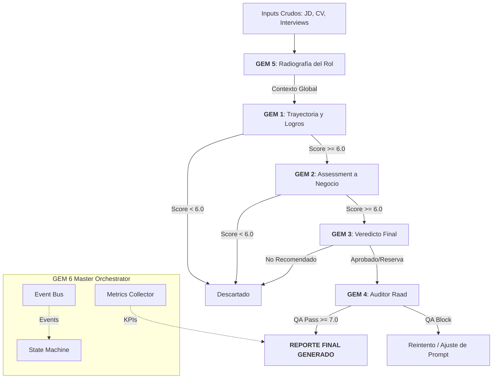

# 🤖 Raadbot – RAAD GEM Industrial Pipeline

**Raadbot** es un agente de IA avanzado diseñado para la **Búsqueda Ejecutiva Industrial**. Su función es automatizar la evaluación de candidatos de alto nivel (C-Level, VP, Directores) transformando datos crudos y heterogéneos en reportes estratégicos estructurados, con una trazabilidad psicópata de la evidencia.

Este proyecto utiliza **Gemini 2.5 Flash / Pro** (vía Google GenAI SDK) y está preparado para ejecución local (CLI), vía API (FastAPI) y orquestación automática mediante **n8n**.

---

## 🏗️ Arquitectura del Sistema: GEM 6 Master Orchestrator

Raadbot opera bajo un patrón de **Orquestador-Worker (GEM 6)** de grado industrial. A diferencia de un pipeline lineal, el sistema utiliza un **Cerebro Central** que coordina la ejecución mediante eventos, estados y validaciones en tiempo real.

### Componentes Core (agente/gem6/):
- **🧠 Orchestrator**: El motor central que maneja el ciclo de vida de cada candidato.
- **🚥 State Machine**: Controla las transiciones (GEM5 -> GEM1 -> GEM2 -> ...) y previene estados inválidos.
- **🚌 Event Bus**: Comunicación desacoplada entre módulos para máxima escalabilidad.
- **📊 Metrics Collector**: KPIs en tiempo real (Tokens, Tiempo, Latencia, Scores).
- **📝 Audit Logger**: Trazabilidad inmutable con checksums SHA-256 para cada decisión.

### 🗺️ Diagrama de Flujo (Evaluation Flow v2.0)



---

## 💎 Módulos GEM (Gemini Evaluation Modules) v2.0

Cada módulo opera en **Modo Analítico-Estratégico** con contratos JSON estrictos:

1.  **🔵 GEM 5 (Radiografía Estratégica):** Define el "dolor real" del cliente y el mandato de éxito a 18 meses. Es el ancla de todo el proceso.
2.  **🟢 GEM 1 (Trayectoria y Logros):** Convierte narrativa en evidencia calibrada. Marca logros como "no calibrados" si falta data.
3.  **🟡 GEM 2 (Assessment a Negocio):** Traduce psicometría y business cases a impacto ejecutivo (CEO language).
4.  **🟣 GEM 3 (Veredicto Final):** Emite recomendación binaria (SÍ/NO) integrando todas las fuentes y referencias 360°.
5.  **🔴 GEM 4 (Auditor Raad):** Actúa como fiscal de calidad. Bloquea reportes con "fluff", alucinaciones o falta de evidencia.

---

## 🚀 Guía de Instalación

### Requisitos
- **Python 3.9+**
- **Google Gemini API Key** (Obtenla en [AI Studio](https://aistudio.google.com/apikey))
- **Google Cloud Credentials** (Opcional, para Google Drive)

### Setup Rápido
```bash
# 1. Clonar e instalar
git clone https://github.com/tomascarminatti-ux/raadbot.git
cd raadbot
pip install -r requirements.txt

# 2. Configurar entorno
cp .env.example .env
# Edita .env y pega tu GEMINI_API_KEY
```

---

## 🕹️ Modos de Operación

### 1. Terminal (CLI)
Ideal para pruebas rápidas o procesamiento local masivo.
```bash
python run.py --search-id SEARCH-2026 --local-dir inputs/SEARCH-001 --json
```

### 2. API REST (FastAPI)
Ejecuta el agente como un microservicio.
```bash
uvicorn api:app --host 0.0.0.0 --port 8000
```

### 3. Orquestación n8n (Recomendado)
Raadbot incluye plantillas en `n8n_workflows/`.
- Soporta **Webhooks asíncronos**: Raadbot ejecuta el pipeline de fondo y "llama de vuelta" a n8n cuando termina.
- **Zero Timeout**: Evita que n8n falle por esperas largas mediante el parámetro `webhook_url`.

---

## 🛠️ Hardening & Seguridad (Production Ready)

-   **State & Checkpoint:** Cada ejecución guarda su estado en `pipeline_state.json`. Si la luz se corta o el LLM falla, Raadbot reanuda exactamente donde quedó sin gastar tokens duplicados.
-   **Schema Validation:** Todas las respuestas del LLM son validadas contra JSON Schemas en `schemas/`.
-   **Smart Retries:** Ante errores de formato o bloqueos de seguridad del LLM, el sistema reintenta con backoff exponencial.
-   **Seguridad de Inputs:** El sistema bloquea automáticamente la ingesta de binarios (PDF/DOCX) en Drive para evitar inyectar basura al contexto del prompt, exigiendo formatos limpios.

---

## 📊 Observabilidad y Costos

El sistema genera un **Dashboard de Decisión** al finalizar:
- **Costo Total:** Cálculo en tiempo real de USD gastados en Gemini.
- **Token Usage:** Desglose de Prompt vs Completion tokens.
- **Trazabilidad:** Cada GEM genera un `.json` estructurado y un `.md` legible por humanos en la carpeta `runs/<search_id>/outputs/`.

---

## 🤝 Contribución
Para mantener la calidad de código:
- Usa `black .` para formatear.
- Los prompts se editan en `prompts/`.
- Los contratos se definen en `specs/`.
